# 🌪️ Vayu: Distributed Air Quality Monitoring System

**Vayu** is a real-time, event-driven microservices architecture designed to monitor air quality (AQI). It uses the **Fan-Out Pattern** to ingest data, archive it for history, and trigger instant alerts for hazardous conditions.

   

## 🏗️ Architecture
The system completely decouples Ingestion (Entry) from Action (Alerts/DB).

```mermaid
graph TD
    User(User/Sensor/WAQI) -- "POST /inject" --> Ingestion[🟢 Ingestion Service]
    Ingestion -- "Raw Event" --> Kafka{🟠 Apache Kafka}
    
    Kafka -- "Topic: raw-aqi-data" --> DB_Service[🔵 Processing Service]
    Kafka -- "Topic: raw-aqi-data" --> Alert_Service[🔴 Alert Hawk Service]
    
    DB_Service -- "Save" --> Postgres[(PostgreSQL)]
    
    Alert_Service -- "1. Check Threshold" --> Logic{AQI > 300?}
    Logic -- "Yes" --> SubDB[(Subscription DB)]
    SubDB -- "Get Emails" --> Email[📧 Send Notification]
    Logic -- "No" --> Ignore[Log & Ignore]
```

Instead of the Ingestion Service talking directly to the Database (tight coupling), I used the **Fan-Out Pattern** with Apache Kafka.

> **How it works:**
> 1. The **Ingestion Service** publishes a single event (`AQI Measured`).
> 2. **Kafka** acts as the central nervous system.
> 3. Two separate Consumer Groups listen to the same topic:
>    * **Group A (Processing):** Archives data for long-term analysis.
>    * **Group B (Alert Hawk):** Checks for immediate danger.

**Benefit:** If the Database goes down, the Alert Service continues to send warnings. The system is resilient.

Since waiting for real-world pollution spikes is impractical for testing, I built a custom **Manual Injection Pipeline**.

* **Endpoint:** `POST /ingestion/inject`
* **Purpose:** Allows developers to simulate specific disaster scenarios (e.g., "What happens if Delhi hits AQI 999?").
* **Mechanism:** This bypasses the WAQI API scheduler and pushes a synthesized payload directly into the Kafka topic, triggering the full system reaction instantly.
* The Alert Service is a **Stateful Microservice** that maintains its own database of user subscriptions.

**The Workflow:**
1.  **Listen:** Consumes every AQI event from Kafka.
2.  **Filter:** Checks if `AQI > Threshold (300)`.
3.  **Lookup:** If dangerous, it queries its local PostgreSQL table (`aqi_subscriptions`) to find users interested in that specific city.
4.  **Notify:** Triggers an email/notification *only* to affected users.

### 1. The Trigger (Subscribe endpoint Alert service)
*Subscribe for a city.*

### 2. The Trigger (Postman)
*Injecting simulated Hazardous data (AQI 450) via the Ingestion Service.*

### 3. Ingestion Microservice Service
*Ingestion microservice manual inject enpoint trigger to inject fake data *

### 4. The Reaction (Alert Microservices Logs)
*Real-time :The Alert Service (Hawk) detects the spike and notifies subscribers, while the Processing Service independently archives the data.*

### 5. The Reaction (Processing Microservices Logs)
*Real-time :The Processing Service also parallelly consume the event check sapital duplication,independently archives the data.*

### 6. The Database (PostgreSQL)
*Data persistence verification showing the event stored in the history table.*

### 7. The Trigger (Unsubscribe)
*Unsubscribe for a city.*

### 8. Alert Service logs
*Unsubscribe for a city.*

### 9. The Database (PostgreSQL)
*Data persistence verification showing the unsubscribed user removed from history table.*

## 👤 Author
**Prashant Jangid**
* [LinkedIn](https://www.linkedin.com/in/prashant-kumar-7145001b5/)
* [GitHub](https://github.com/jangidprashantjee)

---
*Built with passion using Java & Spring Boot.*
